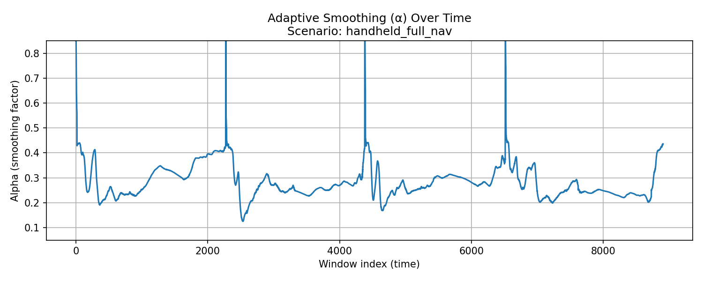
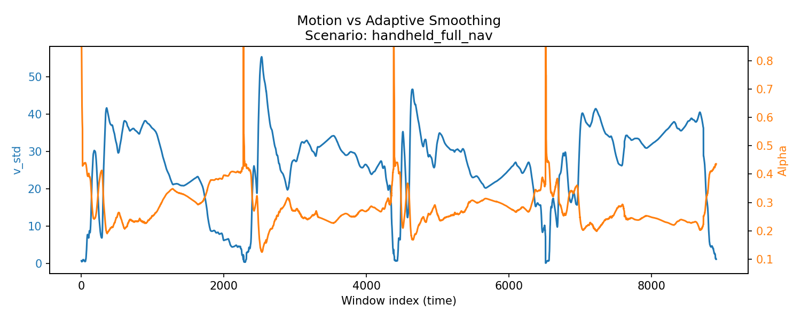

# Evaluation & Results

## Navigation

- [Home](index.md)
- [Architecture](Architecture.md)
- [Feature Engineering](feature_engineering.md)

This page presents the evaluation methodology and results for the adaptive camera smoothing system, with emphasis on **behavioral correctness**, **stability**, and **real-time suitability** rather than abstract ML metrics alone.

Because this project implements a **control signal** (not a classifier or predictor of ground truth), visual and qualitative evaluation plays a central role.

---

## 1. Evaluation Philosophy

Traditional machine learning evaluation focuses on metrics such as accuracy or mean squared error.  
While useful, these metrics are **not sufficient** for real-time camera control systems.

Instead, this project evaluates:

- Temporal smoothness of the predicted smoothing factor (α)
- Responsiveness to changes in motion intent
- Absence of instability or oscillation
- Bounded, physically meaningful output
- Alignment with expected camera behavior

In short:

> **Does the system behave correctly over time?**

---

## 2. Dataset Context

The dataset consists of multiple **motion scenarios**, each representing a common virtual production camera behavior, including:

- handheld navigation
- controlled pans and tilts
- still shots on tripod
- fast intentional movements

Each scenario contains multiple takes, recorded at VP-relevant frame rates (e.g. 25 / 30 / 60 FPS).

Evaluation is performed **within scenarios**, reflecting real-world VP usage where shot context is known.

---

## 3. Train / Test Strategy

Data was split in a **scenario-aware manner**, ensuring:

- training and testing data come from the same motion context
- no temporal leakage across windows
- realistic generalization expectations

This avoids misleading results that can occur when mixing unrelated shot types.

---

## 4. Quantitative Metrics

The regression model predicts a continuous smoothing factor α.

Representative results:

- **Training MSE**: low and stable
- **Testing MSE**: comparable to training error

The close match between training and testing error indicates:
- no overfitting
- stable generalization within scenarios
- consistent behavior across takes

However, numerical error alone does not fully capture control quality.

---

## 5. Temporal Behavior of α

### 5.1 α Over Time (Handheld Navigation)

The plot below shows the predicted smoothing factor (α) over time for the `handheld_full_nav` scenario.

**Observed behavior:**
- α remains low during sustained, intentional movement
- α increases briefly during unstable or jitter-dominated moments
- transitions are smooth and continuous
- no high-frequency oscillation

This confirms that the model responds to **motion intent**, not raw movement magnitude.

---

### 5.2 Motion vs Adaptive Smoothing

To better understand the relationship between motion instability and smoothing, α is plotted alongside a representative motion feature (`v_std`).

**Key observations:**
- increases in velocity fluctuation correspond to increases in α
- sustained motion does not trigger excessive smoothing
- no hard thresholds or mode switches are present

This demonstrates the desired **inverse relationship**:
> More jitter → more smoothing  
> More intent → less smoothing

---

## 6. Output Conditioning

Because the regression model is linear, raw predictions are not inherently bounded.

To ensure physical validity and stability:
- α is clamped to a predefined safe range
- no additional temporal filtering is applied in v1

This ensures:
- no runaway behavior
- no excessive smoothing
- deterministic output

Clamping is treated as **control logic**, not a machine learning correction.

---

## 7. Real-Time Stability

Several properties confirm real-time suitability:

- α varies smoothly over time
- single-frame spikes are eliminated by clamping
- no feedback loops are introduced
- computation cost is constant and minimal

In practice, this results in:
- no perceptible lag during fast camera motion
- visible stabilization during micro jitter
- stable behavior across different frame rates

---

## 8. Qualitative In-Engine Evaluation

When integrated into Unreal Engine and applied to a `CineCameraActor`:

- fast pans and navigation remain responsive
- micro jitter is effectively reduced
- no rubber-banding or floatiness is observed
- camera behavior feels natural and predictable

This qualitative validation is essential, as camera motion is ultimately judged by human perception.

---

## 9. Limitations

Current limitations of the evaluation include:

- reliance on scenario-specific validation
- manual interpretation of plots
- limited exploration of cross-scenario generalization

These limitations are acceptable for v1, given the control-oriented nature of the system.

---

## 10. Summary

The evaluation demonstrates that the system:

- produces a stable, bounded control signal
- adapts smoothing strength based on motion intent
- preserves responsiveness while reducing jitter
- operates safely in real time
- aligns with virtual production requirements

The results validate the design decision to use machine learning as an **adaptive gain estimator**, rather than as a direct controller.

---

## 11. Next Steps

Future evaluation may include:
- per-axis comparative analysis
- rotation-only behavior analysis
- long-duration stability testing
- user studies with VP operators

These extensions can be built on top of the existing evaluation framework.
